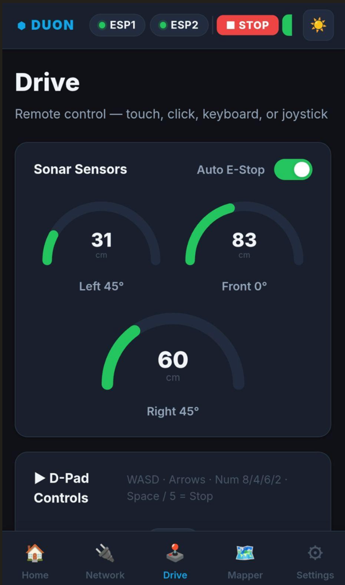
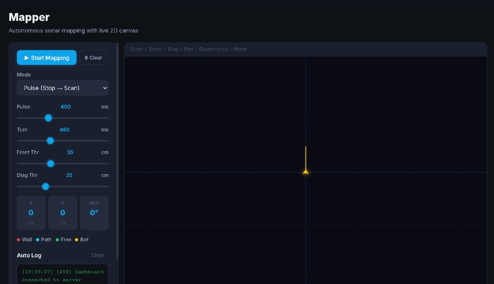
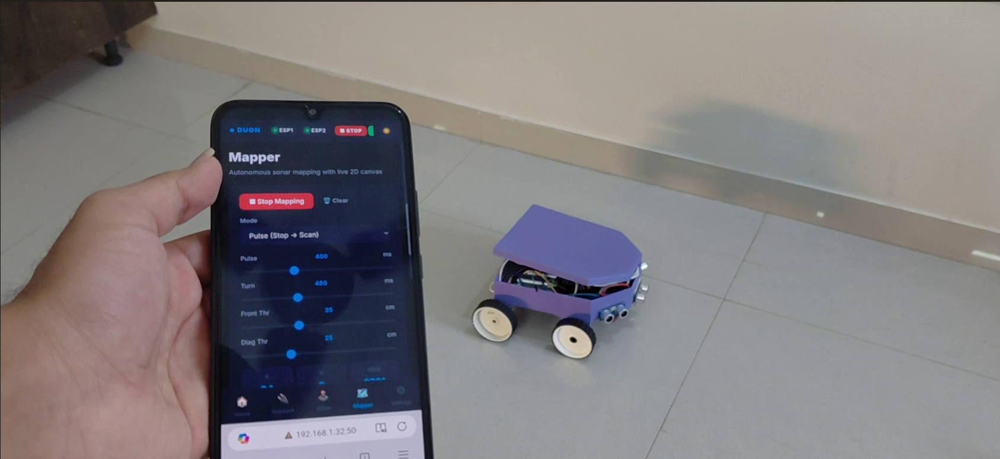
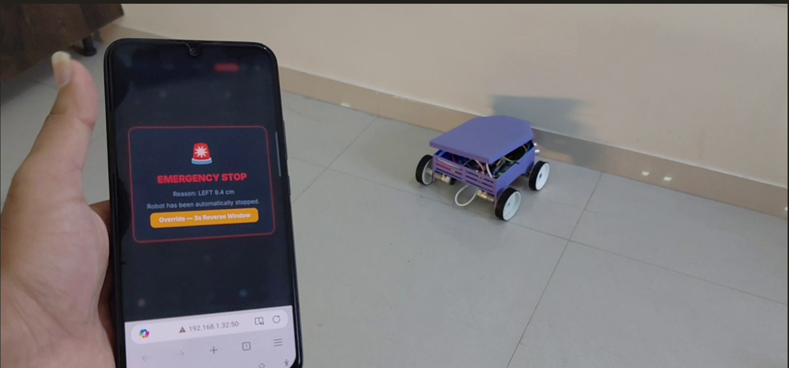

# DUON — Autonomous Mobile Robot for Indoor Material Transportation

> A low-cost Autonomous Mobile Robot (AMR) that performs intelligent indoor material transportation using ESP32 microcontrollers, A* path planning, ultrasonic obstacle avoidance, real-time mapping, and a FastAPI-powered web dashboard.


---

## Overview

DUON is a modular Autonomous Mobile Robot (AMR) designed for autonomous indoor material transportation in environments such as warehouses, laboratories, workshops, and educational facilities.

Unlike traditional educational robots that focus only on motion control, DUON integrates embedded systems, autonomous navigation, wireless communication, obstacle avoidance, real-time telemetry, and an interactive web dashboard into a single cohesive platform.

The project demonstrates how affordable hardware can be combined with intelligent software to build a scalable robotic system without relying on expensive sensors such as LiDAR.

---

## Features

- Autonomous indoor navigation
- A* path planning
- Dual ESP32 distributed architecture
- Wi-Fi communication
- Real-time telemetry
- Live Web Dashboard
- Automatic Emergency Stop
- Sonar-based mapping
- Dynamic obstacle detection
- Manual control mode
- Encoder-based motion control
- Modular software architecture

---

# Project Preview









---

# System Architecture

The robot consists of two major subsystems:

- Embedded Robot Layer
- Supervisory Control Layer

Two ESP32 microcontrollers manage sensing and motion independently while a FastAPI backend handles communication, monitoring, and autonomous navigation.

---

# Technology Stack

## Hardware

- ESP32 Development Boards ×2
- HC-SR04 Ultrasonic Sensors
- Encoder DC Motors
- BTS7960 Motor Drivers
- 3D Printed Chassis
- Li-Ion Battery Pack

---

## Software

- Python
- FastAPI
- HTML
- CSS
- JavaScript
- WebSockets
- TCP Sockets
- AsyncIO

---

## Algorithms

- A* Search
- Occupancy Grid Mapping
- Sonar Filtering
- Dead Reckoning
- Differential Drive Control
- Emergency Stop Logic

---

# Software Architecture

```
                Browser Dashboard
                       │
                 WebSockets
                       │
                FastAPI Server
                       │
        ┌──────────────┴──────────────┐
        │                             │
     ESP32 #1                     ESP32 #2
        │                             │
 Motors + Sonar               Motors + Encoders
        │                             │
        └────────────Robot────────────┘
```

---

# Key Capabilities

✔ Autonomous Navigation

✔ Wireless Robot Control

✔ Live Sensor Visualization

✔ Obstacle Detection

✔ Autonomous Mapping

✔ Emergency Stop System

✔ Modular Embedded Design

---

# Repository Structure

```
DUON/
│
├── backend/
│
├── firmware/
│
├── frontend/
│
├── docs/
│
├── images/
│
├── requirements.txt
│
└── README.md
```

---

# Installation

Clone the repository

```bash
git clone https://github.com/yourusername/duon-autonomous-mobile-robot.git

cd duon-autonomous-mobile-robot
```

Install dependencies

```bash
pip install -r requirements.txt
```

Run the backend

```bash
python app.py
```

Open your browser

```
http://localhost:5000
```

---

# System Workflow

```text
Mission Selected
        │
        ▼
Generate Path (A*)
        │
        ▼
Transmit Commands
        │
        ▼
ESP32 Motion Control
        │
        ▼
Read Sonar Sensors
        │
        ▼
Obstacle Detected?
     │         │
    No        Yes
     │         │
     ▼         ▼
 Continue   Emergency Stop
     │
     ▼
 Update Dashboard
```

---

# Applications

- Warehouse Automation
- Smart Factories
- Material Transportation
- Laboratory Automation
- Indoor Logistics
- Robotics Education
- Autonomous Research Platforms

---

# Future Work

- ROS2 Integration
- SLAM
- LiDAR Navigation
- AI-based Path Planning
- Multi-Robot Coordination
- Vision-Based Object Detection
- Cloud Monitoring
- Mobile App Control

---

# Project Highlights

- Low-cost Autonomous Mobile Robot
- Distributed Dual-ESP32 Architecture
- FastAPI Backend
- WebSocket Communication
- A* Path Planning
- Sonar-Based Environment Mapping
- Real-Time Dashboard
- Wireless Robot Control

---

# Contributors

- **Vedant Patel**

- **Shon Parale**


Interested in Artificial Intelligence, Robotics, Embedded Systems, and Autonomous Systems.

---

# Support

If you found this project interesting, consider giving it a ⭐ on GitHub.
